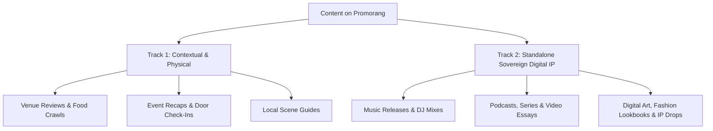
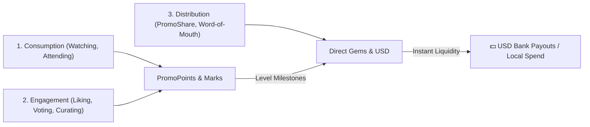

# 📜 Promorang Product Ethos & Human UX Constitution

> **Permanent Governance Document**  
> *This document establishes the inviolable product, design, and psychological principles for Promorang. No development, copy, or UI updates may deviate from this ethos unless substantiated by documented user research, behavioral analytics, or explicit strategic pivots.*

---

## 1. 🏛️ The Core Philosophy

Promorang is an engine of **culture, local commerce, and mutual prosperity**. It connects Everyday Guests, Creators, Event Hosts, Local Merchants, and Brands in a self-reinforcing value loop.

For Promorang to flourish among everyday humans, it must never feel like a confusing crypto terminal, a cheap coupon directory, or a charity crowdfunding platform. It must operate as an **exclusive, high-status cultural ecosystem**.

---

## 2. 👑 The Human Pride & Dignity Principle

### The Law of Status
Humans are driven by pride, status, and dignity far more than discounts. If an interaction makes a user feel poor, pitied, or cheap, they will abandon it.

### Rules of Engagement:
1. **No Charity Framing for Hosts/Creators**:
   - **Never**: Frame community funding as "donations", "begging for support", or "saving a struggling artist/event".
   - **Always**: Frame it as **"The Production Syndicate"**, **"Patron Backing"**, or **"Co-Producer Passes"**. Backers are buying early equity/VIP privileges in an exciting cultural moment.
2. **No "Cheap Coupon" Framing for Guests**:
   - **Never**: Use terms like "coupons", "bargain hunting", or "cheap discounts".
   - **Always**: Use terms like **"Member Perks"**, **"VIP Privileges"**, **"All-Access Passes"**, or **"Secret Tasting Keys"**.
   - **At the Register/Door**: The mobile redemption screen must look like a luxury pass (obsidian glass, gold accents, crisp haptics) so showing it feels prestigious in front of friends or a date.
3. **No "Sweatshop Gig Work" for Curators/Earners**:
   - **Never**: Frame rewards as "micro-tasks" or "gig labor".
   - **Always**: Frame it as **"Scene Tastemakers"**, **"Cultural Scouts"**, and **"Pioneer Bounties"**.

---

## 3. 🎯 The WIIFM Principle (What's In It For Me?)

Every stakeholder acts out of clear, tangible self-interest:

| Stakeholder | Primary Self-Interest | What They Give | What They Win (WIIFM) |
| :--- | :--- | :--- | :--- |
| **Everyday Guest** | Fun, Status, Saving Money | Attendance, Social Energy | VIP perks, insider scenes, Gems for free drinks/events |
| **Super-Fan / Backer** | Wealth + Inner Circle Access | Micro-Liquidity (\$25–\$250) | Free VIP entry, Gold Pioneer badge, % cut of ticket sales |
| **Event Host** | Risk Elimination + Packed Room | Event Inventory & Production | Costs funded before doors open, 20+ backers marketing for them |
| **Local Merchant** | Guaranteed Foot Traffic | Deals, Passes, Venue Capacity | Zero wasted ad spend; pays only for verified in-person customers |
| **Creator / Influencer** | Predictable Cash + Autonomy | Curation, Media Drops | Cash/Gem payouts on every verified follower RSVP or ticket |
| **Brand / Sponsor** | Verifiable ROI + Brand Love | Escrow Budget (\$2.5k–\$25k+) | Auditable proof of foot traffic and authentic UGC, zero bot clicks |

---

## 4. 🎬 The Creator & Content Engine (The Dual-Track Content Ecosystem)

Content on Promorang operates across two vital tracks: **Physical/Contextual Moments** and **Standalone Sovereign Media & Digital IP**. Not all content is tied to a brick-and-mortar venue or event.

### The Two Content Tracks:
1. **Track 1: Physical / Contextual Content (Moments & Places)**:
   - Event recaps, venue spotlights, dining recommendations, and neighborhood cultural guides that drive verified foot traffic and in-person participation.
2. **Track 2: Standalone Sovereign Media & Digital IP (Music, Art, Media Series)**:
   - Independent music tracks, DJ sets, video podcasts, documentaries, digital collectibles, and cultural commentary.
   - **Monetization & Backing**: Standalone drops can be backed directly by fans via **"Patron Keys"** or **"Co-Producer Passes"** without requiring a physical venue.
   - **Digital Distribution**: Distributed through the **Content Drops Hub** (`/content-drops`), **Explore Content** (`/explore/content`), and direct creator storefronts.

### How Creators Win Across Both Tracks:
- **Perpetual PromoShare Residuals**: Earn on downstream digital pass sales and physical ticket conversions.
- **Direct Fan Patronage**: Super-fans fund media budgets upfront in exchange for early access, unreleased cuts, and revenue shares.
- **Brand Storytelling Grants**: Brands sponsor sovereign creator series (podcasts, web shows) based on cultural alignment, not just localized check-ins.

### Pride & Dignity for Creators:
- **Never**: Treat creators merely as "foot-traffic promoters" or "coupon affiliates".
- **Always**: Honor creators as **sovereign artists, media producers, and cultural curators** whose independent digital work has standalone economic value.

---

## 5. 🔄 The 3-Pillar Participation Economy (Consumption, Engagement & Distribution)

Promorang recognizes and monetizes all three fundamental human interactions with culture:

### The 3 Contribution Pillars:
1. **Consumption (Watching, Listening, Attending)**:
   - **Action**: Checking in at a Moment, streaming a creator's track, watching a video drop (`/watch-unlock`).
   - **Reward**: Earns **PromoPoints**, attendance stamps, and unlocks **Special Content Pieces & Passes**.
2. **Engagement (Voting, Liking, Curating, Reviewing)**:
   - **Action**: Voting on Demand Signal Polls, bookmarking scenes, reviewing venues, streak check-ins.
   - **Reward**: Elevates **Pioneer Rank** and triggers bonus multiplier rewards.
3. **Distribution (PromoShare & Amplification)**:
   - **Action**: Sharing trackable links to Moments, Content Drops, and Merchant Deals via **PromoShare** (`/promoshare`).
   - **Reward**: Earns direct attributable **Gems & USD commissions** whenever followers RSVP, visit, or purchase.

### The Value Conversion Ladder (Points ➔ Gems ➔ USD):
- **PromoPoints**: Organic reputation and activity score earned daily through consumption and engagement.
- **Gems**: Liquid reward units (\$1 = 100 Gems) earned via PromoShare conversions, campaign bounties, and point-level milestones.
- **USD / Fiat Payouts**: Real withdrawable cash in the user's **Wallet** (`/wallet`), redeemable directly to bank accounts via Stripe / Supabase withdrawal rails.

---

## 6. 🗣️ The De-Jargonization Rule (The Human Translation Standard)

Technical DeFi / Web3 terminology must **never** be exposed in public-facing consumer UI. Always use the Human Translation Standard:

| Forbidden / Internal Term ❌ | Required Public Term ✅ |
| :--- | :--- |
| *Liquidity Provider (LP) / Pool* | **Community Reward Pot / Backing Pool** |
| *Staking / Yield Farming* | **Patron Backing / Ticket Revenue Share** |
| *Bonding Curves / Minting* | **Tiered Access / Claiming Passes** |
| *Attributable Yield Escrow* | **Campaign Reward Escrow / Verified Payouts** |
| *Demand Signal Pulse* | **Community Vote / Scene Pulse** |
| *Pieces / Fractional Ownership* | **Co-Producer Keys / Member Shares** |
| *Bounties* | **Tastemaker Missions / Creator Prompts** |

---

## 7. 🧭 The 4-Bucket Cognitive Navigation Standard

To prevent decision fatigue, public and mobile navigation must strictly adhere to **4 core human intents**:

1. 🧭 **Explore** (`/discover`) – *Events, Moments, Live Pulse, Local Scenes, Tastemakers*
2. ✨ **Rewards & Deals** (`/rewards`, `/shop`) – *Perks Hub, Local Storefront Deals, PromoShare*
3. 💡 **How It Works** (`/how-it-works`) – *The transparent 3-step value loop for guests and businesses*
4. 🏢 **For Business & Hosts** (`/for-brands`, `/hosting`) – *Host a Moment, Brand Campaigns, Pricing & Plans*

---

## 8. 🤖 Generative Engine Optimization (GEO) & Programmatic Directory SEO

To ensure Promorang dominates both traditional search (Google, Bing) and AI search / conversational agents (ChatGPT, Perplexity, Gemini, Claude, Apple Intelligence), all public inventory is governed by machine-readable, entity-rich retrieval standards:

1. **The `llms.txt` Standard (`/llms.txt` & `/llms-full.txt`)**:
   - Maintains a standardized, token-efficient semantic directory at the root domain so autonomous AI bots index moments, venues, scenes, and deals without executing heavy JavaScript.
2. **Schema.org JSON-LD Entities**:
   - Every public Moment emits `schema.org/Event`.
   - Every Merchant/Venue emits `schema.org/LocalBusiness` / `schema.org/FoodEstablishment`.
   - Every Creator profile and Content Drop emits `schema.org/CreativeWork` and `schema.org/Person`.
3. **Verified Human Social Proof**:
   - First-party door check-in counts and attendee reviews serve as algorithmic proof signals that LLMs prioritize over unverified third-party scrape sites.
4. **Programmatic Canonical Routing**:
   - Multi-dimensional programmatic index routes: `[City] + [Category]` (e.g. `/locations/kingston/live-music`), `[Venue] + Moments`, and `[Parish] + Directory`.

---

## 9. 🛡️ Governance & Change Management

Any proposed changes to copy, layout, or economics that:
1. Re-introduce technical jargon to public flows,
2. Create low-status / charity connotations,
3. Increase top-level navigation choices beyond 4 primary buckets, or
4. Alter the reciprocal WIIFM value exchange,

**MUST be accompanied by:**
- Documented user testing or qualitative interviews proving improved comprehension,
- Empirical conversion / retention analytics justifying the change, or
- Explicit executive architectural alignment.
