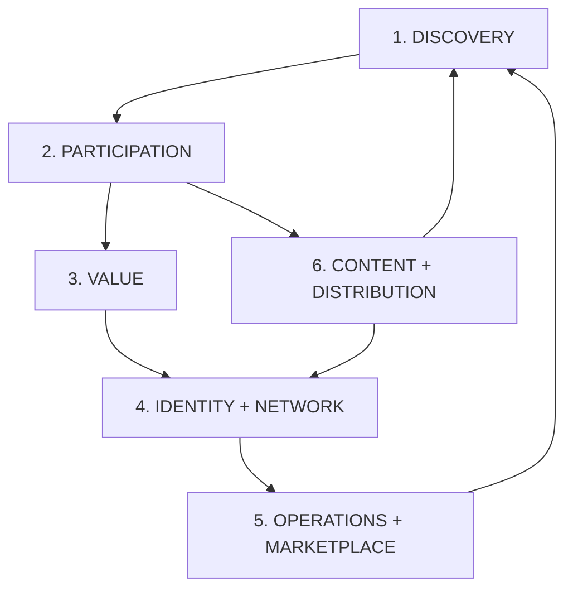
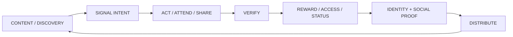
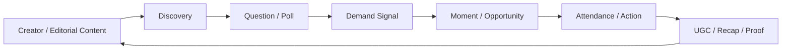

# Promorang Product Universe & Surface Matrix

**Status:** Canonical product architecture working document  
**Purpose:** Prevent route sprawl, feature leakage, and UI complexity by separating the **Promorang engine** from the **Promorang experience**.

This document inventories the major systems already represented in the repository and classifies where each system should appear.

The governing principle is:

> **Promorang may be deep. The interface must not be complicated.**

Complexity is allowed in the engine. Complexity must earn its right to appear in the interface.

---

## 1. The Promorang Product Universe

Promorang is not one linear application. It is a multi-sided cultural participation system with six connected layers.

### Layer 1 — Discovery
How attention enters Promorang.

- Editorial discovery
- Moments & events
- Places & venues
- Discovery polls / questions
- Scene signals / pulse
- Search
- Promorang Presents
- Opportunity Radar
- Location and category discovery
- Featured placements

### Layer 2 — Participation
How a human expresses intent or contributes.

- Vote
- React
- Save
- Follow
- Join a Scene
- RSVP
- Check in
- Review
- Submit content
- Complete a mission
- Refer
- Invite friends
- Share
- Create a Moment
- Back / support eligible experiences

### Layer 3 — Value
What participation can unlock.

- PromoPoints / Pioneer Points
- Gems
- PromoKeys / Promorang Access
- Rewards / member perks
- Wallet
- Vault
- PromoShare commissions
- Affiliate attribution
- Referral rewards
- Pieces / Member Shares / Co-Producer Keys
- Commerce receipts
- Verified value receipts
- Membership / paid access

### Layer 4 — Identity + Network
How repeated participation becomes a durable user relationship.

- User profile
- Saved items
- Following
- Scenes
- Participation history
- Memories
- Pieces portfolio
- Rank / status
- Referral graph
- Crew / friends
- Creator graph
- Host / merchant relationships
- Taste / preference graph

### Layer 5 — Operations + Marketplace
The operator side of the same system.

- Ops Theater
- Host guest operations
- Organizer workspace
- Merchant action studio
- Campaign intelligence
- Analytics
- Participants
- UGC review
- Proposal workspace
- Offer studio
- PromoPush
- PromoShare admin
- Featured placement admin
- KYC admin
- Steward dashboard
- Service catalog
- Brand campaigns
- Venue operations
- Commerce management

### Layer 6 — Content + Distribution
The acquisition and amplification engine.

- Content Drops
- Creator content
- Watch / unlock
- UGC
- Gallery
- PromoShare
- Referral links
- Affiliate links
- Creator missions
- Sponsored content
- Editorial content
- Social amplification
- PromoPush

---

## 2. The Core Flywheel

The user-facing product should make this sophisticated system feel simple.

Business flywheel underneath:

> **Distribution → Participation → Proof → Revenue → Retention → Network Growth**

---

# 3. Canonical Consumer Navigation

The route inventory is large, but the everyday consumer should not see the route inventory as navigation.

## Logged-out / public

1. **Explore**
2. **Rewards & Access**
3. **How Promorang Works**
4. **For Business & Hosts**

## Logged-in participant

Recommended canonical shell:

1. **Home**
2. **Discover**
3. **Saved**
4. **Rewards**
5. **You**

Mobile/PWA can render these as bottom navigation. Desktop can render them as top or side navigation.

These are **containers for intent**, not a list of Promorang mechanics.

---

# 4. Product Surface Matrix

Legend:

- **Primary** — should be visible as a normal part of the consumer experience.
- **Contextual** — appears when relevant; should usually not be top-level navigation.
- **Dedicated** — may deserve its own destination, but does not need permanent navigation.
- **Operator** — primarily for hosts, brands, creators, merchants, stewards, or admins.
- **Internal** — implementation/economic concept; should rarely or never be consumer-facing terminology.

| System | Consumer visibility | Consumer action | Dedicated destination? | Operator surface | Canonical role |
|---|---|---|---|---|---|
| Home / For You | Primary | Browse, continue plans | Yes | No | Personalized return surface |
| Discover | Primary | Browse, search, filter | Yes | No | Core discovery surface |
| Discovery Polls | Contextual + Primary within Discover | Vote / signal | Usually no | Analytics / Ops Theater | Demand sensing |
| Discovery Questions | Contextual | Answer | Usually no | Analytics / Ops Theater | Preference & demand sensing |
| Pulse / Momentum | Contextual | View movement | Maybe, editorial only | Ops Theater | Social proof / trend signal |
| Moments / Events | Primary objects | RSVP, save, attend | Yes | Host Ops | Actionable cultural object |
| Venues / Places | Primary objects | Visit, save, follow | Yes | Merchant / Venue Ops | Place discovery |
| Scenes | Primary identity layer | Join, follow | Yes | Steward / Scene Ops | Community / taste graph |
| Promorang Presents | Primary editorial layer | View, save, RSVP | Yes | Editorial / Featured admin | Curated recommendation layer |
| Content | Primary feed/object | Watch, react, save, share | Yes | Creator tools / UGC review | Acquisition & culture layer |
| Content Drops | Contextual / dedicated | Watch, support, share | Yes | Creator tools | Sovereign creator IP |
| Watch Unlock | Contextual | Watch / unlock | No permanent nav | Creator / campaign tools | Gated media mechanic |
| Saved | Primary | Revisit / plan | Yes | No | Personal intent memory |
| Following | Contextual / profile | Follow / unfollow | Maybe | Creator analytics | Social graph |
| Crew / Friends | Contextual | Invite / coordinate | Maybe | No | Social coordination |
| Referrals | Contextual | Invite / share | Yes for history/status | Attribution analytics | Growth loop |
| Affiliate / PromoShare | Contextual | Share attributable link | Yes for earnings | PromoShare admin | Distribution economics |
| PromoPoints | Contextual | Earn / spend | Rewards destination | Economy analytics | Participation reputation |
| Pioneer Points / Rank | Contextual | Earn status | Profile / Rewards | Economy analytics | Identity/status |
| Gems | Contextual | Earn / withdraw/spend | Wallet | Finance / campaign ops | Liquid reward unit |
| Rewards / Member Perks | Primary | Claim / redeem | Yes | Merchant / campaign ops | Consumer value |
| PromoKeys / Access | Contextual | Claim / present | Access wallet / pass | Host / merchant verification | Prestige access |
| Wallet | Contextual + dedicated | View balance / withdraw | Yes | Finance / compliance | Money layer |
| Vault | Dedicated, advanced | Store / view assets | Yes | Finance | Advanced value storage |
| Pieces | Contextual + dedicated collection | Collect / view / share | Yes | Issuance / economy | Cultural proof / contribution record |
| Trading Marketplace | Advanced | Trade eligible assets | Dedicated, hidden from novices | Marketplace ops | Advanced economic layer |
| KYC | Conditional | Verify identity | No top-level nav | KYC admin | Compliance gate |
| Check-in | Event-day contextual | Verify presence | No | Host Ops / Ops Theater | Proof of attendance |
| Participation Receipt | Contextual after action | View / share | Activity / Memory | Analytics | Proof of contribution |
| Memories | Contextual / profile | Revisit history | Yes within You | No | Retention & identity |
| Missions / Bounties | Contextual | Complete action | Optional dedicated board | Campaign / host ops | Guided participation |
| Bounty Board | Secondary | Browse missions | Yes but not primary nav | Campaign ops | Opportunity inventory |
| Commerce / Marketplace | Contextual + dedicated | Buy / claim | Yes | Merchant ops | Local commerce |
| Offers | Contextual | Claim / purchase | Object detail | Offer Studio | Commercial activation |
| Storefronts | Object destination | Browse / buy | Yes | Merchant ops | Merchant presence |
| Commerce Receipt | Contextual after transaction | View proof | Activity / receipt route | Analytics | Purchase proof |
| Promorang Access | Contextual + dedicated | Present / claim | Yes | Verification | Access system |
| Promorang Crew | Contextual | Invite / coordinate | Maybe | No | Social participation |
| PromoPush | Not normal consumer nav | Respond to push / activation | Landing only | Core operator tool | Distribution activation |
| Opportunity Radar | Contextual / advanced | Discover opportunities | Yes for scouts/operators | Ops Theater | Supply/demand opportunity layer |
| Event Scout | Advanced / contributor | Submit / enrich | Yes for scouts | Steward / Ops | Inventory acquisition |
| Scout Enrichment | Advanced | Add data | No consumer nav | Steward / Ops | Data quality |
| City Stewards | Public identity + operator | Follow / contribute | Yes | Steward dashboard | Local network operations |
| Creator Profiles | Primary object | Follow / view content | Yes | Creator dashboard | Creator identity |
| Brand Profiles | Secondary public object | Follow / view campaigns | Yes | Brand dashboard | Brand identity |
| Merchant Profiles | Secondary public object | Visit / browse | Yes | Merchant dashboard | Merchant identity |
| Host Profiles | Secondary public object | Follow / view Moments | Yes | Host dashboard | Host identity |
| Campaigns | Usually contextual | Participate | Landing/detail routes | Brand/agency Ops | Funded activation layer |
| Campaign Intelligence | No | — | No consumer nav | Brand / agency | ROI & optimization |
| Analytics | No | — | No consumer nav | Operator | Reporting |
| Participants | No | — | No consumer nav | Host / campaign ops | Audience operations |
| UGC Review | No | — | No consumer nav | Creator / brand ops | Content moderation/approval |
| Organizer Workspace | No | — | No consumer nav | Host | Event operations |
| Host Guest Operations | No | — | No consumer nav | Host | Guest logistics |
| Merchant Action Studio | No | — | No consumer nav | Merchant | Activation setup |
| Offer Studio | No | — | No consumer nav | Merchant / brand | Offer creation |
| Proposal Workspace | No | — | No consumer nav | Sales / operator | Commercial proposal workflow |
| Service Catalog | No / sales only | — | Public sales optional | Operator | Service packaging |
| Featured Placements | Consumer sees result, not system | Click featured item | No | Featured admin | Paid/editorial distribution |
| Ops Theater | Consumer sees outputs only | — | Never consumer nav | Core operator surface | Real-time operating system |
| Admin | No | — | Protected | Admin | Platform operations |
| Developer Console | No | — | Protected / developer | Developer | Platform extensibility |

---

# 5. Route Families Already Present in `apps/web`

The current route imports demonstrate that Promorang already contains most of the universe above. Routes should be treated as implementation details and consolidated into product families.

## A. Consumer discovery family

Representative pages/components:

- `Index`
- `Discover`
- `DiscoveryDetail`
- `ExploreMoments`
- `ExploreVenues`
- `ExploreRewards`
- `ExploreContent`
- `ForYou`
- `Pulse`
- `PulseFeed`
- `Momentum`
- `Search`
- `CategoryArchive`
- `LocationArchive`
- `PromorangPresents`
- `OpportunityRadar`

**Recommendation:** These should feel like one discovery system, not separate products.

## B. Moments & attendance family

- `MomentDetail`
- `EventExperienceDetail`
- `GuestRsvp`
- `GuestPass`
- `CheckIn`
- `MomentRecord`
- `MomentsApp`
- `CreateMoment`
- `EditMoment`

**Recommendation:** Consumer journey is object-first: discover → intent → RSVP/save → access → check-in → receipt. Creation/operations stay role-specific.

## C. Content & creator family

- `Creators`
- `CreatorDetail`
- `ExploreContent`
- `ContentDrops`
- `ContentDropDetail`
- `WatchUnlock`
- `ContentMissionDetail`
- `Gallery`
- `UGCReview`

**Recommendation:** Content is a first-class discovery feed and acquisition engine. Creator tools should not leak into participant navigation.

## D. Social, referrals & identity family

- `UserProfile`
- `Following`
- `Saved`
- `Activity`
- `Referrals`
- `ActivatedReferralsDashboard`
- `PromorangCrew`
- `Pioneers`
- `PioneerPoints`
- `MemoryDetail`

**Recommendation:** Consolidate participant-facing identity under **You**, with contextual invite/referral mechanics embedded in Moments, Scenes, Content and rewards.

## E. Rewards, access & economy family

- `ExploreRewards`
- `Wallet`
- `Vault`
- `PromorangAccess`
- `PiecePortfolio`
- `PieceProfile`
- `TradingMarketplace`
- `LiquidityDashboard`
- `ClaimPages`
- `KYCPage`
- `MembershipCheckout`
- `BillingResult`
- `EconomyConcept`
- `GemRushPage`

**Recommendation:** New users see **Rewards, Access, Points, Pieces** progressively. Advanced liquidity/trading/economic terminology should remain gated and role-appropriate.

## F. Commerce & merchant family

- `Marketplace`
- `CommerceDetail`
- `CommerceReceiptDetail`
- `MerchantStorefront`
- `OfferDetail`
- `MerchantCouponHub`
- `AddProduct`
- `AddVenue`
- `VenueProfile`
- `Merchants`

**Recommendation:** Consumer sees offers/perks/places naturally inside discovery and rewards. Merchant creation tools stay in merchant workspace.

## G. Campaign, brand & activation family

- `Brands`
- `BrandProfile`
- `CampaignDetail`
- `CreateCampaign`
- `CampaignIntelligence`
- `ActivationDetail`
- `CreateBounty`
- `OfferStudio`
- `PromoPush`
- `PromoPushCreator`
- `PromoPushLanding`
- `PromoPushEntry`
- `ReferralSprintPage`
- `SeasonShowdownPage`
- `CampaignLanding`
- campaign-specific hubs

**Recommendation:** Consumers should see the activation, not the campaign-management machinery.

## H. Host / organizer / operations family

- `OrganizerWorkspace`
- `OrganizerLanding`
- `HostGuestOperations`
- `Participants`
- `Hosting`
- `Hosts`
- `StewardDashboard`
- `MerchantActionStudio`
- Ops Theater components

**Recommendation:** Treat as a distinct operator mode with higher information density and real-time operational telemetry.

## I. Distribution / PromoShare family

- `PromoShare`
- `PromoShareAdmin`
- `Referrals`
- `ActivatedReferralsDashboard`
- `PromoPush`
- `FeaturedBooking`
- `FeaturedPlacementsAdmin`

**Recommendation:** Sharing is contextual in consumer flows. Attribution, commissions, booking and campaign distribution deserve their own advanced/partner surfaces.

## J. Business / sales / enterprise family

- `ForBrands`
- `ForCreators`
- `ForMerchants`
- `ForAgencies`
- `ForEnterprise`
- `ForCommunities`
- `ForCauses`
- `ForDevelopers`
- `SolutionsHub`
- `ServiceCatalog`
- `ProposalWorkspace`
- commercial proposal pages

**Recommendation:** These are acquisition/sales surfaces, not participant-product navigation.

---

# 6. Ops Theater Definition

Ops Theater should be understood as the **operating system behind the consumer experience**.

The consumer might see:

> Aqua Fest — Heating Up  
> 782 interested

The host / brand / operator should see:

- Live interest count
- Interest velocity
- RSVP conversion
- Save-to-attend conversion
- Referral velocity
- Top acquisition sources
- Top creators
- Top Scenes
- Geographic concentration
- PromoKey claims
- Check-ins
- Verified attendance
- UGC volume
- Reward budget consumption
- PromoPush performance
- Commerce conversion
- Drop-off points
- Recommended next action

Ops Theater therefore should **not** be simplified using the same rules as the participant home.

It should be dense, real-time, actionable and role-aware.

### Consumer output from Ops Theater

The consumer sees **signals**:

- Heating up
- Selling fast
- Your Scene is moving
- Friends are going
- Access available
- Almost full
- New perk

The operator sees **telemetry and controls**.

---

# 7. Discovery Polls as Core Infrastructure

Discovery polls are not a side feature. They are one of Promorang's core demand-sensing mechanisms.

They should surface contextually across:

- Home
- Discover
- Scene pages
- Content
- Moment pages
- Campaigns
- Creator drops
- Push notifications

Poll examples should be human and action-oriented:

- Would you go?
- Which night works?
- Who would you bring?
- Which artist do you want?
- Which venue should host this?
- What would make you show up?
- Which should we unlock next?

Poll results feed:

- Personalization
- Scene Pulse
- Opportunity Radar
- Event / Moment demand
- Ops Theater
- PromoPush targeting
- Brand intelligence
- Creator intelligence

---

# 8. Referrals, Friends & Affiliate Architecture

These systems should share one attribution foundation but present differently depending on context.

## Consumer invitation

> Andre is going. Join him?

Primary motive: social coordination.

Possible reward: PromoPoints, crew perk, access.

## Referral

> Invite someone to Promorang.

Primary motive: network growth.

Possible reward: PromoPoints, rank, perk.

## Affiliate / PromoShare

> Share this trackable Moment / offer / content object.

Primary motive: distribution and attributable conversion.

Possible reward: Gems / cash commission where eligible.

### Rule

Do not make users decide whether something is an "invite", "referral" or "affiliate link" before sharing.

The sharing action is simple. The economic consequence can vary underneath.

---

# 9. Pieces Architecture

Pieces should not be treated as decorative collectibles.

A Piece should represent durable proof of meaningful participation, contribution, access or early cultural signal.

Possible Piece sources:

- Attended a significant Moment
- Voted before demand threshold
- Brought verified attendees
- Helped unlock a Moment
- Created influential content
- Completed a sponsored mission
- Backed a creator/event
- Earned a rare access tier
- Participated in a historical cultural moment

A Piece can contain:

- Event / object identity
- Date and place
- User contribution type
- Verification state
- Relative timing / early-signal percentile
- Referral contribution
- Creator / venue / brand provenance
- Access tier
- Limited edition / issuance data where relevant

Consumer meaning:

> **I was there. I found it early. I helped move it.**

---

# 10. Content Architecture

Content is not merely something to consume inside Promorang. It is a distribution and discovery engine.

Canonical loop:

Content should therefore be able to:

- Attach to a Moment
- Attach to a Scene
- Attach to a Venue
- Attach to a Discovery
- Create a Discovery
- Carry an invite/share attribution link
- Generate PromoPoints through engagement
- Generate PromoShare attribution through distribution
- Become a Piece or qualify a user for a Piece where appropriate

---

# 11. Progressive Disclosure by User Maturity

## Stage 0 — Visitor

Understands:

- Things to discover
- Things happening
- Promorang Presents
- Basic value proposition

Does not need to understand:

- Gems
- Pieces
- PromoShare economics
- Wallet
- Ops Theater
- Liquidity

## Stage 1 — New participant

Learns:

- Save
- Vote
- RSVP
- Scenes
- PromoPoints
- Rewards
- Access

## Stage 2 — Returning participant

Learns:

- Friends / Crew
- Referrals
- Participation history
- Rank
- Pieces
- Better access

## Stage 3 — Distributor / super-user

Learns:

- PromoShare
- Affiliate economics
- Gems
- Earnings
- Advanced Pieces
- Missions

## Stage 4 — Creator / Host / Merchant / Brand

Gets operator mode:

- Workspaces
- Campaigns
- Ops Theater
- Analytics
- Audiences
- Offers
- PromoPush
- Distribution controls

---

# 12. Recommended Product Modes

Promorang should not force one navigation model on every role.

## Consumer Mode

Low cognitive load.

Home / Discover / Saved / Rewards / You

## Creator Mode

Content / Missions / Audience / Earnings / Profile

## Host Mode

Moments / Guests / Ops Theater / Distribution / Revenue

## Merchant Mode

Venue / Offers / Traffic / Ops Theater / Revenue

## Brand / Agency Mode

Campaigns / Audience / Ops Theater / Content / ROI

## Steward / Admin Mode

City / Inventory / Quality / Ops Theater / Governance

Users with multiple roles can switch modes. Do not merge all modes into one mega-dashboard.

---

# 13. Systems That Should NOT Become Permanent Consumer Navigation

Even if they have routes today:

- Ops Theater
- Analytics
- Participants
- Campaign Intelligence
- KYC
- Liquidity Dashboard
- Trading Marketplace for ordinary users
- PromoShare Admin
- Featured Placements Admin
- UGC Review
- Proposal Workspace
- Offer Studio
- PromoPush Creator
- Merchant Action Studio
- Organizer Workspace
- Service Catalog

These should be role-gated or contextually linked.

---

# 14. Systems That Should Be Contextual Rather Than Standalone Features

- Discovery polls
- Invite friends
- Referral prompts
- Check-in
- PromoKey claim
- PromoPoints earned state
- Piece issuance
- Missions
- Watch unlock
- Crew coordination
- Affiliate sharing
- Verification receipts

They can still have history/detail pages, but the **entry point should be the object/action where they matter**.

---

# 15. Canonical Object Model for the Consumer Experience

The consumer should mostly encounter a small set of understandable objects:

1. **Content** — something to watch/read/listen to
2. **Discovery** — something to react to or answer
3. **Scene** — a world/community/taste layer
4. **Moment** — something actionable in time/place
5. **Place** — venue/merchant/location
6. **Reward / Access** — value unlocked
7. **Person / Creator** — someone worth following
8. **Piece** — proof/history/status

Everything else should largely behave as verbs, system states or operator mechanics.

---

# 16. Product Governance Rules

Before adding a new consumer route, ask:

1. Is this a genuinely new human intent, or merely a new implementation object?
2. Can it appear contextually inside Home, Discover, Saved, Rewards or You?
3. Does a normal participant need to understand this terminology?
4. Is this actually an operator feature?
5. Does this duplicate an existing product family?
6. Does this improve the core flywheel?

If the answer suggests contextual placement, do not add permanent navigation.

---

# 17. Immediate Architecture Decisions

The current prototype work supports the following provisional decisions:

### Adopt conceptually

- Responsive web + PWA as one product
- Editorial, photography-led public discovery
- Personalized logged-in Home
- Contextual discovery polls
- Contextual rewards/access
- Saved plans
- Event-day mode
- Verification receipts
- Scenes as identity/community layer
- Promorang Presents as curated recommendation layer
- Progressive disclosure
- Mode-specific operator interfaces

### Preserve and integrate

- Content Drops
- PromoShare
- referrals / activated referrals
- Pieces
- wallet/economy
- Missions
- marketplace/commerce
- PromoPush
- Opportunity Radar
- creator/host/merchant/brand profiles
- Ops Theater

### Do not expose indiscriminately

- advanced economy vocabulary
- operator analytics
- campaign setup
- KYC/liquidity/trading
- admin tooling
- route-level product taxonomy

---

# 18. Next Implementation Step

Do **not** convert every prototype into production screens independently.

The next implementation phase should create a shared responsive product shell and canonical object components, then migrate product families into it.

Recommended order:

1. Consumer shell: Home / Discover / Saved / Rewards / You
2. Canonical object components: Content, Discovery, Scene, Moment, Reward, Person, Piece
3. Onboarding + personalization handoff
4. Discovery detail + intent loop
5. Saved plan + event-day mode
6. Referrals / crew / contextual share
7. Rewards / Access / Pieces integration
8. Content loop
9. Operator mode shells
10. Ops Theater integration
11. Advanced economy / marketplace surfaces

The goal is not to shrink Promorang.

The goal is to make the entire Promorang machine **legible through progressive interaction** rather than through navigation complexity.
