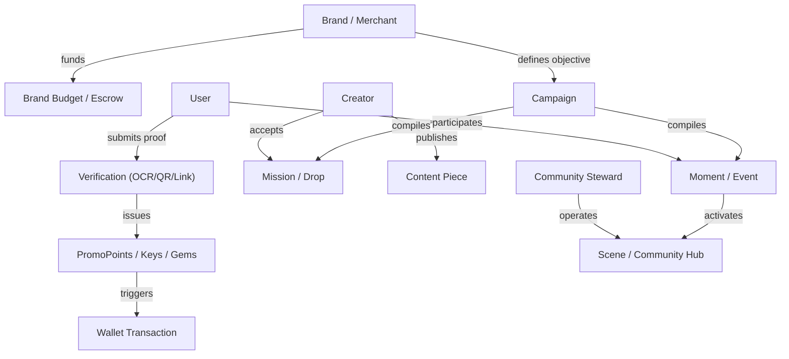

# Promorang Operating Graph & Economic Loop Blueprint

**Document:** `docs/agents/promorang-operating-graph.md`  
**Purpose:** Model Promorang's product, database, and economic entities as a machine-operable graph for AI agents.

---

## 1. Operating Graph Architecture Overview

Promorang acts as a system of record and execution for social demand orchestration.
Agents operate on Promorang by observing nodes in this graph, evaluating relationships, and executing explicit tools against existing business services.



---

## 2. Graph Node Specifications

### 1. User
- **Source of Truth:** Table `users` (`id`, `mocha_user_id`, `user_type`, `user_tier`, balances).
- **Relationships:** Belongs to Wallets, User Follows, Social Actions, Drop Applications, Notifications.
- **Actions:** Register, complete profile, earn points/gems, redeem rewards, follow users.
- **Events:** `user_created`, `user_updated`, `user_level_up`, `streak_updated`.
- **Data for Agent Reasoning:** `user_tier`, `xp_points`, `level`, `points_streak_days`, historical engagement.
- **Permissions:** Self (`auth.uid() = mocha_user_id`) or Admin.
- **Reversibility:** Non-reversible user identity; profile edits are mutable.
- **Financial/Reward Implications:** Holds balance of PromoPoints, PromoKeys, Gems, USD.

### 2. Creator
- **Source of Truth:** Table `users` (where `user_type = 'regular'` and creator metrics present) & `content_pieces`.
- **Relationships:** Creates Content Pieces, applies for Drops, earns from sponsorships/shares.
- **Actions:** Publish content, apply for proof drops, receive sponsorships, share revenue.
- **Events:** `creator_application_submitted`, `content_piece_created`, `sponsorship_received`.
- **Data for Agent Reasoning:** Creator tier, follower count, category, share price, historical engagement rate.
- **Permissions:** Creator ownership or Brand campaign operator.
- **Reversibility:** Content publication irreversible on external social networks; platform record editable.
- **Financial/Reward Implications:** Earns Gems, USD dividends, and piece minting equity.

### 3. Merchant / Brand
- **Source of Truth:** Table `organizations` & `brand_budgets` & `merchant_products`.
- **Relationships:** Owns Campaigns, Brand Budgets, Products, Offers, Coupons.
- **Actions:** Allocate budget, create demand plans, launch campaigns, approve payouts.
- **Events:** `brand_created`, `budget_allocated`, `campaign_created`, `offer_redeemed`.
- **Data for Agent Reasoning:** Remaining budget, active campaigns, conversion rates, product catalog.
- **Permissions:** Organization Member / Admin role (`merchant` or `brand`).
- **Reversibility:** Budget allocation reversible before deployment; executed payouts irreversible.
- **Financial/Reward Implications:** Primary capital provider funding Gem pools, Stripe charges, and escrow.

### 4. Campaign
- **Source of Truth:** Table `campaigns` & `demand_plans`.
- **Relationships:** Belongs to Organization/Brand; contains Drops, Moments, and Missions.
- **Actions:** Draft, compile, approve, launch, pause, complete.
- **Events:** `campaign_drafted`, `campaign_published`, `campaign_completed`.
- **Data for Agent Reasoning:** Objective, target count, target audience, budget, timeframe, performance metrics.
- **Permissions:** Organization Owner / Campaign Operator.
- **Reversibility:** Drafts are editable/deletable; active campaigns require controlled pause.
- **Financial/Reward Implications:** Locks allocated budget in escrow upon launch.

### 5. Mission / Drop
- **Source of Truth:** Table `drops` & `drop_applications`.
- **Relationships:** Child of Campaign; assigned to Users/Creators; produces Verifications.
- **Actions:** Create drop, apply, submit proof, approve submission, issue gems.
- **Events:** `drop_created`, `drop_applied`, `proof_submitted`, `proof_verified`.
- **Data for Agent Reasoning:** `drop_type`, `difficulty`, `key_cost`, `gem_reward_base`, `max_participants`, proof requirements.
- **Permissions:** Creator / Brand / System Verifier.
- **Reversibility:** Application approval reversible prior to submission; verified completion irreversible.
- **Financial/Reward Implications:** Deducts key cost, distributes Gem rewards upon verified completion.

### 6. Moment
- **Source of Truth:** Table `moments` & `moment_participations`.
- **Relationships:** Belongs to Host/Venue/Brand; linked to Content and Relays.
- **Actions:** Schedule moment, check-in, verify attendance, distribute escrow yield.
- **Events:** `moment_created`, `moment_started`, `checkin_verified`, `moment_completed`.
- **Data for Agent Reasoning:** `moment_mode`, `pulse_state`, `capacity`, location, pricing tier.
- **Permissions:** Host / Operator / User participant.
- **Reversibility:** Scheduling mutable; physical check-ins irreversible once verified.
- **Financial/Reward Implications:** Escrow pool distribution to verified attendees and host.

### 7. Community / Scene / Hub
- **Source of Truth:** Table `seasons` & `operators`.
- **Relationships:** Managed by Community Steward; aggregates Moments, Missions, and Users.
- **Actions:** Join hub, participate in season, achieve rank on leaderboard.
- **Events:** `hub_created`, `user_joined_hub`, `season_frozen`, `season_allocated`.
- **Data for Agent Reasoning:** Member count, active moments, category alignment, participation velocity.
- **Permissions:** Operator Steward / Admin.
- **Reversibility:** Membership mutable; seasonal rewards allocated periodically.
- **Financial/Reward Implications:** Pioneer Points allocation and seasonal pool dividends.

---

## 3. Product Economic Loops

### Loop 1: Discovery Loop
```
Discover Opportunity → Evaluate Fit & Value → Take Action → Receive Value → Discover Next Opportunity
```
- **Current Support:** Fully supported via `/api/feed`, `/api/today`, and `/api/search`.
- **Agent Value Add:** Agent analyzes user/creator profile signals and targets optimal opportunities.

### Loop 2: Reward & Verification Loop
```
User Action → Submit Proof (OCR/QR/Link) → Verification Service → Issue Points/Keys/Gems → Unlock Next Tier
```
- **Current Support:** Fully supported via `aiVerificationService.js`, `gemsService.js`, `dynamicPointsService.js`.
- **Agent Value Add:** Agent designs missions with proof types matched to merchant intent.

### Loop 3: Creator Mobilization Loop
```
Creator Joins → Matched to Mission → Produces Content/Distribution → Receives Value & Equity → Higher Rank
```
- **Current Support:** Supported via `drops`, `content_pieces`, `pieceMintingService.js`.
- **Agent Value Add:** Agent filters and invites creators based on historical audience conversion.

### Loop 4: Growth & Network Loop
```
User Participates → Recruits via Referral/PromoShare → New User Joins → Network Value Increases → Expanded Reach
```
- **Current Support:** Supported via `referralService.js`, `promoShareService.js`.
- **Agent Value Add:** Agent incorporates referral loops into compiled campaign recommendations.

### Loop 5: Merchant Demand Loop
```
Merchant States Goal → Agent Orchestrates Campaign Draft → Human Approves → Mobilizes Network → Merchant Sees ROI
```
- **Current Support:** Core engine exists in `demandPlanCompilerService.js`; Agentic layer introduced in Phase 1.
- **Agent Value Add:** Campaign Operator Agent translates raw business objectives into defensible campaign drafts.
